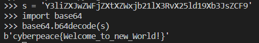
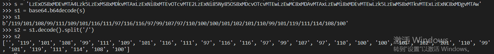
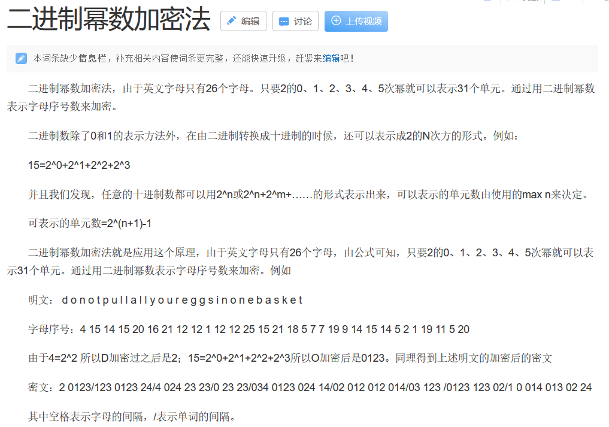
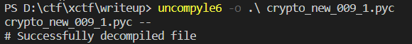
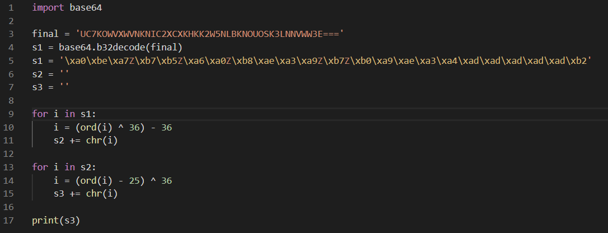
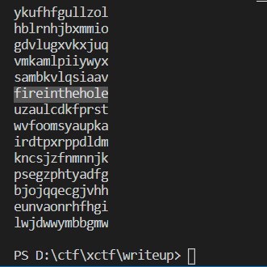
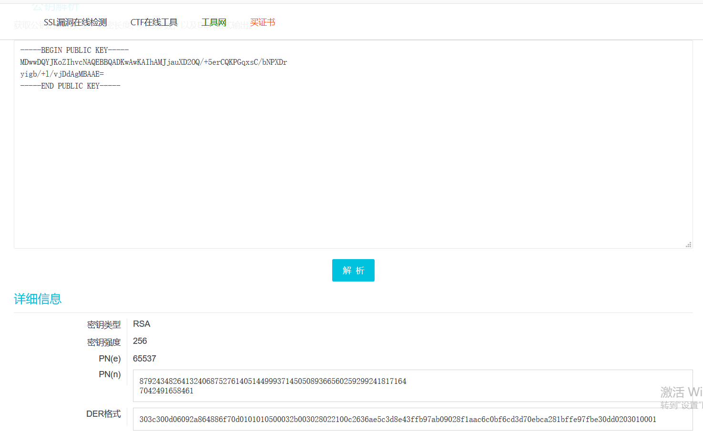
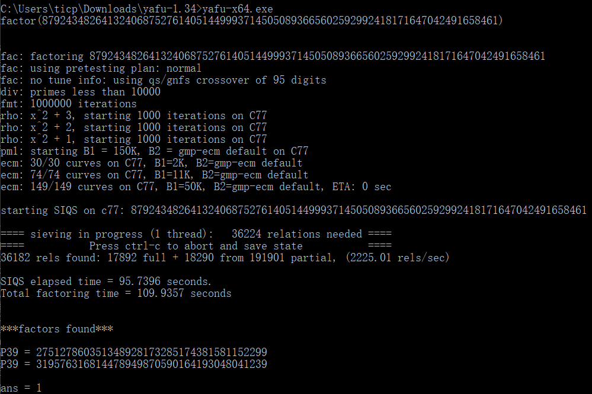
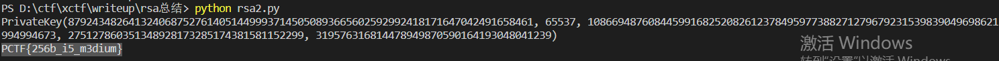
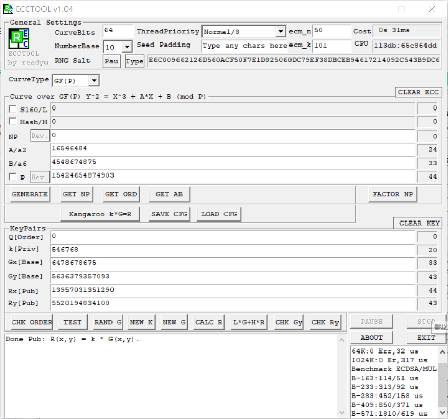

# crypto

## 新手练习区

### 001 base64
使用python中的base64模块来解码即可

### 002 Caesar
凯撒密码，偏移量为12

推荐一个在线工具非常齐全 [ctf在线工具](http://ctf.ssleye.com/)

### 003 Morse
摩尔斯电码，给的是1/0格式，相当于线/点，用上面那个在线工具就可以解码

### 004 不仅仅是Morse
和上一题一样先用摩尔斯电码译码，注意分隔符不是空格而是/，得到一串奇怪的字符，根据题目提示用培根密码，所以取非AB开始的子串用培根算法解密

### 005 混合编码
先看提供的字符串，以==结尾，判断应该是base64类型，先解码一次

以&#格式开头查询是Unicode的编码格式，在网上找一个在线Unicode解码

再用base64解码一次，得到的格式比较像acsii码，再用python解码

### 006 幂数加密
一开始查了一下幂数加密，分析了一下发现并不对，不能用上

然后查到了一个01248密码，又称为云影密码，使用 0，1，2，4，8 四个数字，其中 0 用来表示间隔，其他位数字求和 如：28=10，124=7，18=9，再用 1->26 表示 A->Z。

可以看出该密码有以下特点，只有 0，1，2，4，8。

写了一个[py脚本](crypto_new_006_1.py)来解密

#### 007 Railfence
这个相当明显了，题目当中提到了栅栏，而且还提到了5，其实观察一下也可以发现cy之间隔了4个字母，断定密钥是5

### 008 easy_RSA
复习一下RSA，选两质数（p，q），越大越安全，求N = (p - 1) * (q - 1)，然后求d，使得d满足e * d = 1 (mod N)，此时e作为私钥，d作为公钥，可用公钥加密私钥解密，也可以用私钥加密公钥解密。

本来自己编写了一个脚本来求d，不过速度非常慢。后面在网上看到python有libnum这个库，可以用来求逆，所以就用了这个库。  

### 009 easychallenge
最开始看到pyc文件是二进制文件，然后就在vscode装了一个能够读二进制的插件，读了一下对应十六进制文本，有一些信息但是看不出来什么东西，发现了flag文本以及base32，以===结尾也可以猜测是base32编码

后面就分析不出来了，在网站上看了writeup，原来pyc是可以反编译的，用到了python的一个库uncompyle6

然后开始分析反编译后的源码，输入的flag经过三次编码，然后和final = 'UC7KOWVXWVNKNIC2XCXKHKK2W5NLBKNOUOSK3LNNVWW3E==='作比较，相同则说明flag对了。也就是说，要得到flag，对fianl作三次编码的逆运算，反过来解码三次就得到了flag

写了一个脚本来解码，需要注意的是，base64库解码出来的数据类型是bytes，和平时用的str是不一样的，在网上看了很多东西都没有合适的解决方案，于是最后以及拷贝到一个新的字符串，然后按编码的方式反过来解码即可

### 010 转轮机加密
一开始看到二战还有转轮机，以为是恩尼格码类型，后面又看到了托马斯·杰斐逊，然后到网上看了一下，发现转轮机和恩尼格码机还是不太一样的。转轮机有若干个转盘（本题13个），边缘上乱序排布这26个字母，根据密钥先把转盘按顺序排布一下，然后根据密码，转动每个转盘，使得密文都排布在同一列（这里我设在了第一列），然后一次读取其他列，最终找到能看懂的一串作为flag，比较坑的是不用加cyberpeace{}或者flag{}，我在这里一直过不去。

### 011 Normal_RSA
这个是我遇到的rsa类型第二种，题目给了一个由公钥加密的密文文件，另外还给了一个公钥文件，首先将公钥pem文件解析一下，有在线解析工具，也可以用openssl进行解析，得到rsa算法当中的n, e。

然后需要分解大整数n，这一步也有在线工具，不过有一个工具叫yafu，用来分解也是非常快的

得到rsa算法中的各个参数之后，用python当中的rsa模块生成私钥，并用私钥解密文件，得到flag。

### 012 easy_ECC
（十分后悔当初没有学好抽象代数）

首先在网上找了一些资料看一下，先复习一下ecc的基本原理，有篇[博客](https://bbs.pediy.com/thread-253672.htm)写的非常详细，感觉很适合入门，看完基本就理解了。

刚开始打算自己用py实现一遍，但是感觉工作量有点大，而且网上有现成的工具了，ecctool非常好用。打开软件记得先选进制为10！然后依次输入椭圆曲线的三个参数p a b，还有私钥k以及基点G，然后开始运行就可以计算出公钥R了。

