# reverse

## 新手练习区

### 001 insanity

用vscode的插件以十六进制打开文件即可，然后就可以看到flag，注意开头是9447

### 002 game

一个编译好的exe文件，游戏的内容就不说了，将exe拖入IDA中进行分析，注意要用32位，64位好像不能编译，然后按 shift + F12 ，再按 Alt + T 查找关于flag的字符串

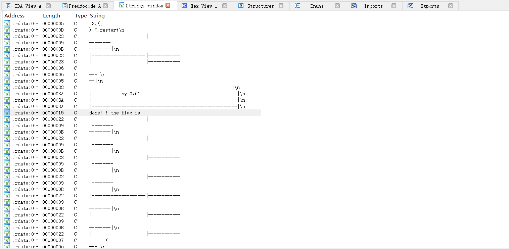

当查找到相应位置的字符串后，双击在 IDA View-A 查看，还需要按 Ctrl + X 引用到当前位置，再按 F5 进行反编译，查看C源码

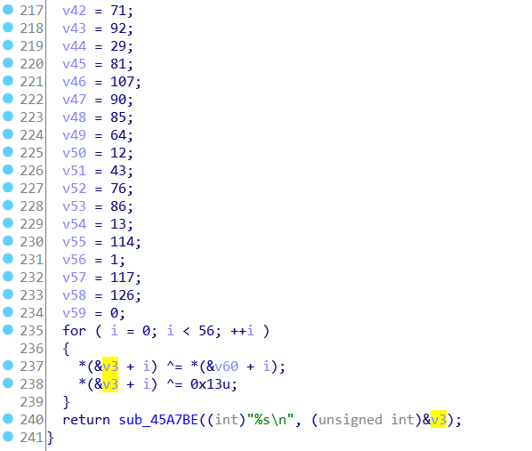

可以发现给出了两组数字，分别取两组中的各个数字异或运算，然后再和0x13异或，作为一个字符，最后拼到一起，我写了个脚本来实现

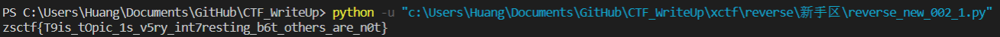

### 003 Hello, CTF

一个编译好的exe文件，打开之后随意输入，发现显示error，所以拖入IDA后也和上一题一样去搜索字符串，然后发现是在main函数当中

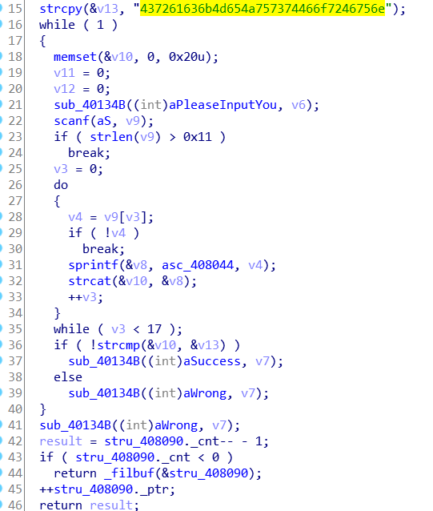

函数的主要功能是，以十六进制的格式给字符串v13赋值，然后用户输入字符串到v9，且长度不能超过17，然后将v9当中的各个字符拷贝到v10，最后将v10与v13作比较，相同则返回成功，所以就用了python来把v13的字符串还原一下

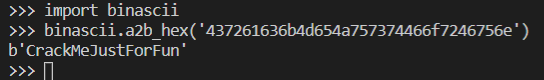

然后重新打开exe尝试一下，是正确的。注意提交flag的时候，不用加什么外壳格式flag{}，直接提交CrackMeJustForFun就可以了

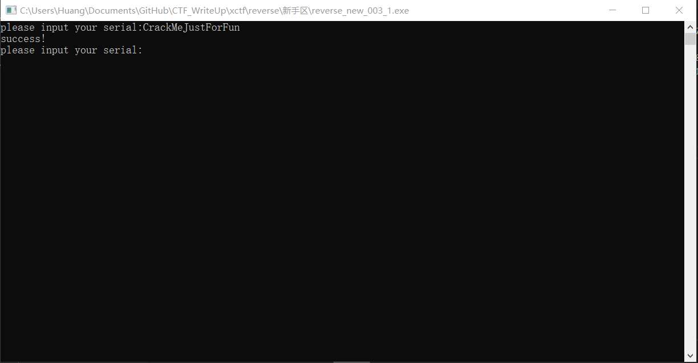

### 004 open-source

这个题目比较简单，直接提供C源码了，刚开始想用gcc编译然后输入参数去做但是报错了，后面就用py模仿着运行一下

输入三个参数，第一个是十六位整型数，第二个整型数要满足特定条件，第三个是一个字符串，然后计算一下hash值，最后以十六进制输出，注意提交flag不用外壳

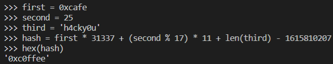

### 005 simple-unpack

首先用upx进行脱壳，[下载地址](https://github.com/upx/upx/releases)

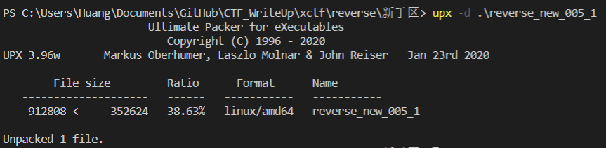

然后用IDA64进行反汇编，在main函数里面马上就能看到flag了

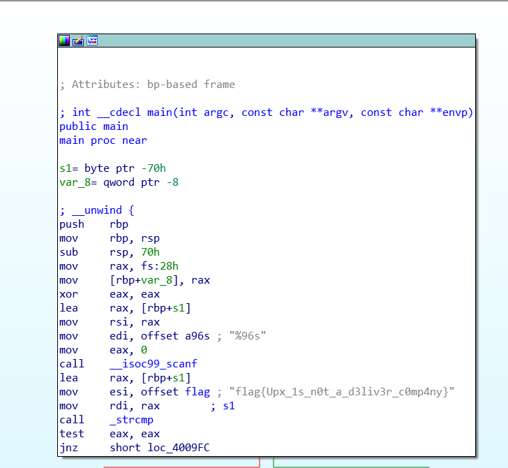

### 006 logmein

首先放入IDA中，选中main函数，然后反编译看一下main的功能，要求输入一个特定的字符串和程序当中的那个一致的话则报成功

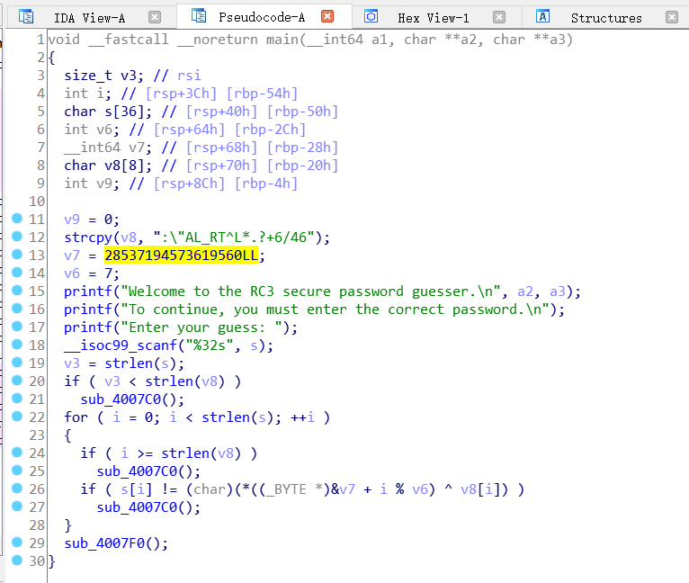

仿照流程自己写一个cpp然后输出flag，直接提交即可不需要加{}

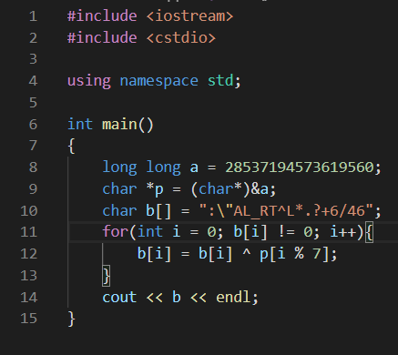

### 007 getit

在IDA中先进入main函数，分析一下函数的主要功能，是用字符串s中的字符作处理后替换掉t的某些字符，然后写入到/tmp/flag.txt中去，但是这个目录是Linux下的临时目录，也就是说程序运行完会消失，不会把文件保留下来

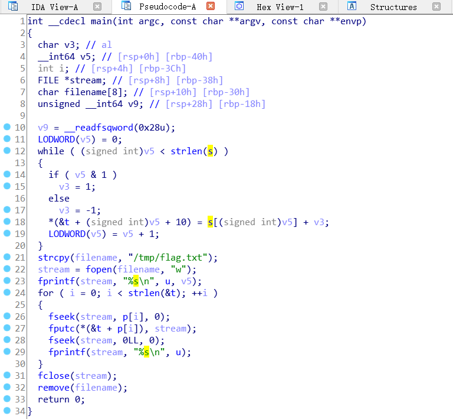

然后去看字符串s和t的具体内容，可以发现t的开头部分是flag的格式，分析程序也可以知道中间部分的？最终将被替换掉

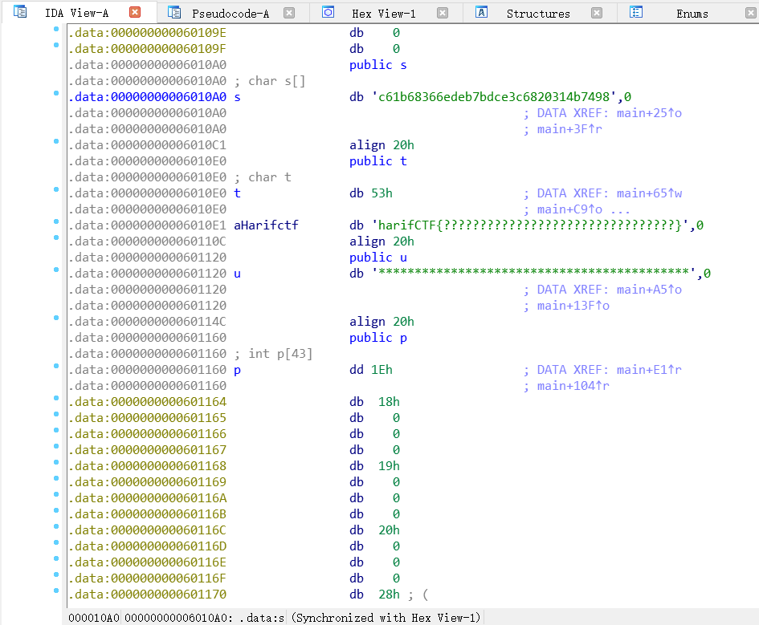

然后写一个脚本模仿t字符串的替换过程，最终输出flag

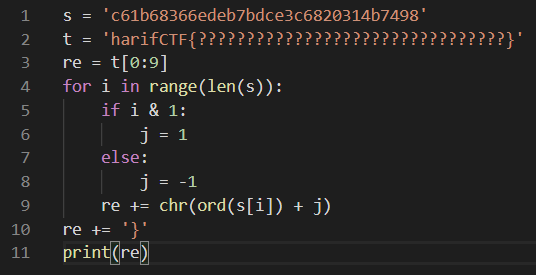

