# 记录攻防世界WriteUp

## misc

### 新手练习区

#### 001 this_is_flag
题目里面写的就是flag

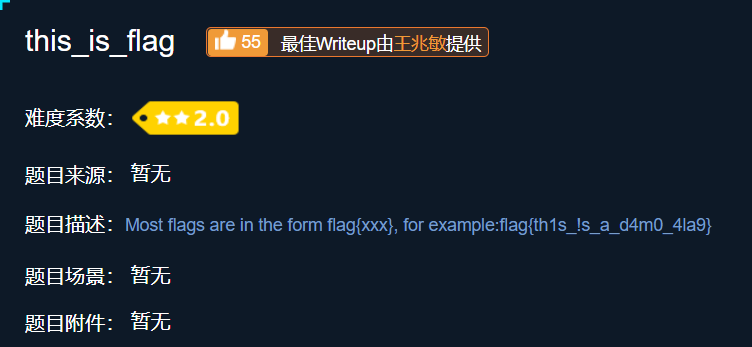

#### 002 pdf
将pdf格式的文件转成word就可以看到flag

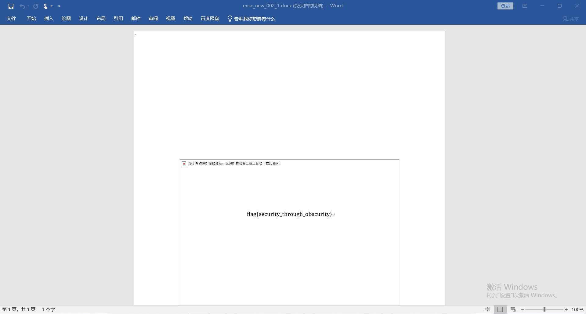

#### 003 give_you_flag
给了一个gif，其中有一帧有一个二维码，不会ps，在网上找了别人修好的图，扫码就可以看到flag了。

#### 004 gif
给了一系列的黑白图片，猜测黑应该是表示1，白表示0，然后看了一下长度是104，8的倍数，且每八位开头都是0，很有可能是ascii码，用py转化了一下就看到结果了

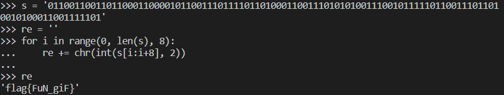

#### 005 掀桌子
给了一长串字符，观察一下发下都在f以内，很有可能是十六进制的格式，然后看一下长度也是偶数，有可能两位一组构成一比特，然后每个比特用ascii编码表示，但是都是大于128的数值，所以还要处理一下，减去128，然后再转成ascii编码。

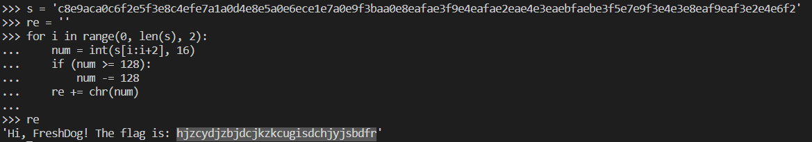

#### 006 如来十三掌
先到[与佛论禅](http://www.keyfc.net/bbs/tools/tudoucode.aspx)解密一次

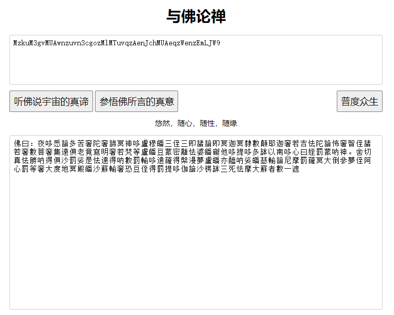

然后根据题目的十三，用rot13解码一次

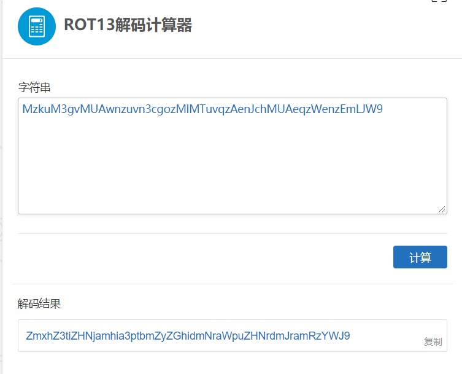

最后用base64解码得到flag

#### 007 SimpleRAR
先尝试解压，发现解压失败了，没有头绪去看了别人的writeup，感觉很难想到

首先，用winhex把压缩把的这个7A字段改成74，74在rar里面表示图片

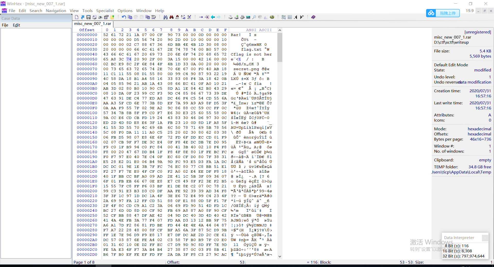

这次解压就能成功解压得到新的图片文件

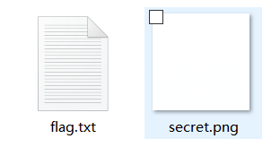

然后继续查看图片的二进制内容，发现开头说明了格式是gif，所以又把图片改成gif后缀。

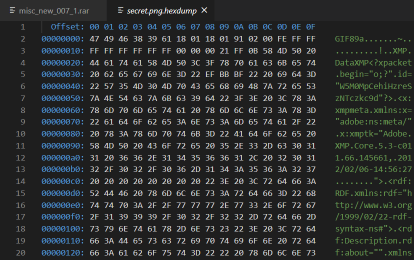

最后这一步要用ps，把两个图层分开拼成一张二维码，然后还要补上定位点

### 高手进阶区

******

## pwn

******

## web

### 新手练习区

#### 001 view_source
按F12打开查看器即可看到网页源码

#### 002 get_post
url处传get参数

用hackbar传post参数

#### 003 robots
(百度)robots协议也叫robots.txt（统一小写）是一种存放于网站根目录下的ASCII编码的文本文件，它通常告诉网络搜索引擎的漫游器（又称网络蜘蛛），此网站中的哪些内容是不应被搜索引擎的漫游器获取的，哪些是可以被漫游器获取的。因为一些系统中的URL是大小写敏感的，所以robots.txt的文件名应统一为小写。robots.txt应放置于网站的根目录下。

#### 004 backup
php的备份有两种：*.php~和*.php.bak

#### 005 cookie
在控制台查看cookie

用Burp截包查看响应报文

#### 006 disabled_button
把disabled属性删除，按钮就可以按下了

#### 007 weak_auth
根据提示用户名root，弱密码（123456）可以去爆破

#### 008 command_execution
先尝试能否注入命令

发现可以轻松注入后，查找flag文件

查看flag

#### 009 simple_php
分析代码可知要传入两个参数，取a='0'，比较的时候会把a转成数字，如果作逻辑判断则看成非空字符串

b的话传1235a，这样is_numberic会判断不是数字，但是比较的时候会转成1235然后和1234作比较

#### 010 xff_referer
查到http报文头部有两个字段：xff(X-Forwarded-For)是用来识别通过HTTP代理或负载均衡方式连接到Web服务器的客户端最原始的IP地址的HTTP请求头字段，简而言之用来伪造IP，Referer是header的一部分，当浏览器向web服务器发送请求的时候，一般会带上Referer，告诉服务器该网页是从哪个页面链接过来的，服务器因此可以获得一些信息用于处理，简而言之可以伪造域名

#### 011 webshell
用php的system函数来执行命令，先查看目录

然后查看flag

#### 012 simple_js
先在网站尝试了几次密码都不成功，于是就查看网页源代码，发现了一段js代码，拷贝到本地自己分析一下（web_new_012_1.js），代码非常冗余，自己先分析整理一下，除去一些无用变量，到最后发现用户输入的参数其实没有用上，都是被一组常量覆盖掉（web_new_012_2.js）

然后发现除了用户传入的参数，还传了一组参数，所以那个输入参数才应该是正确的密码，开一个终端按照函数的处理方式一下，得到的结果再补上flag的格式Cyberpeace{xxxxxxxxx}即可

### 高手进阶区

******

## reverse

******

## crypto

### 新手练习区

#### 001 base64
使用python中的base64模块来解码即可

#### 002 Caesar
凯撒密码，偏移量为12

推荐一个在线工具非常齐全 [ctf在线工具](http://ctf.ssleye.com/)

#### 003 Morse
摩尔斯电码，给的是1/0格式，相当于线/点，用上面那个在线工具就可以解码

#### 004 不仅仅是Morse
和上一题一样先用摩尔斯电码译码，注意分隔符不是空格而是/，得到一串奇怪的字符，根据题目提示用培根密码，所以取非AB开始的子串用培根算法解密

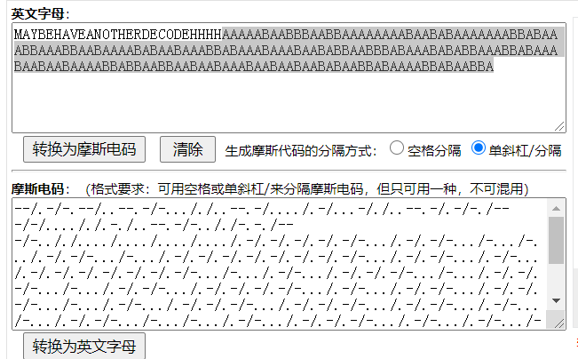
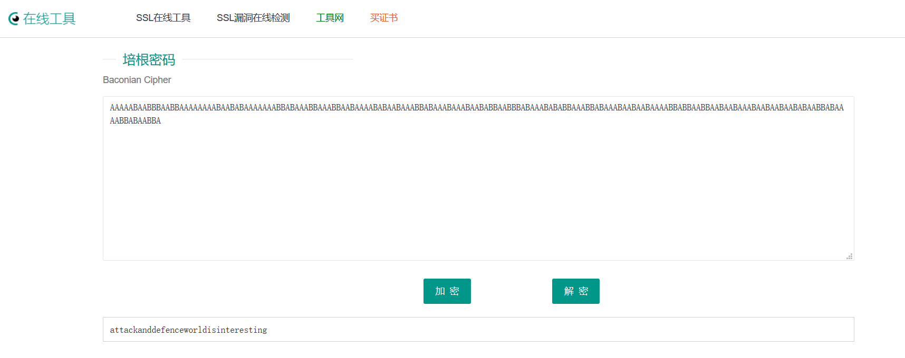

#### 005 混合编码
先看提供的字符串，以==结尾，判断应该是base64类型，先解码一次

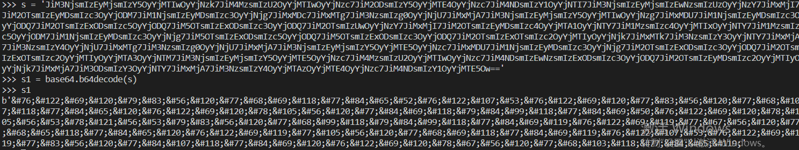

以&#格式开头查询是Unicode的编码格式，在网上找一个在线Unicode解码

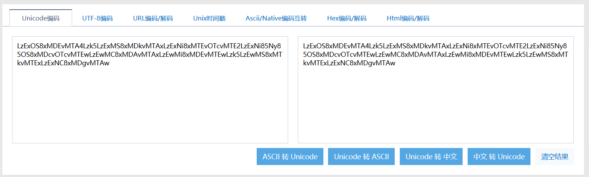

再用base64解码一次，得到的格式比较像acsii码，再用python解码

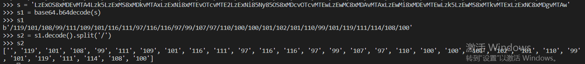

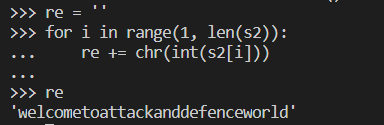

#### 006 幂数加密
一开始查了一下幂数加密，分析了一下发现并不对，不能用上

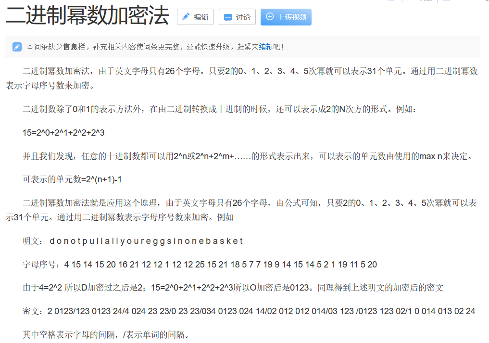

然后查到了一个01248密码，又称为云影密码，使用 0，1，2，4，8 四个数字，其中 0 用来表示间隔，其他位数字求和 如：28=10，124=7，18=9，再用 1->26 表示 A->Z。

可以看出该密码有以下特点，只有 0，1，2，4，8。

写了一个[py脚本](crypto_new_006_1.py)来解密

#### 007 Railfence
这个相当明显了，题目当中提到了栅栏，而且还提到了5，其实观察一下也可以发现cy之间隔了4个字母，断定密钥是5

#### 008 easy_RSA
复习一下RSA，选两质数（p，q），越大越安全，求N = (p - 1) * (q - 1)，然后求d，使得d满足e * d = 1 (mod N)，此时e作为私钥，d作为公钥，可用公钥加密私钥解密，也可以用私钥加密公钥解密。

本来自己编写了一个脚本来求d，不过速度非常慢。后面在网上看到python有libnum这个库，可以用来求逆，所以就用了这个库。  

#### 009 easychallenge
最开始看到pyc文件是二进制文件，然后就在vscode装了一个能够读二进制的插件，读了一下对应十六进制文本，有一些信息但是看不出来什么东西，发现了flag文本以及base32，以===结尾也可以猜测是base32编码

后面就分析不出来了，在网站上看了writeup，原来pyc是可以反编译的，用到了python的一个库uncompyle6

然后开始分析反编译后的源码，输入的flag经过三次编码，然后和final = 'UC7KOWVXWVNKNIC2XCXKHKK2W5NLBKNOUOSK3LNNVWW3E==='作比较，相同则说明flag对了。也就是说，要得到flag，对fianl作三次编码的逆运算，反过来解码三次就得到了flag

写了一个脚本来解码，需要注意的是，base64库解码出来的数据类型是bytes，和平时用的str是不一样的，在网上看了很多东西都没有合适的解决方案，于是最后以及拷贝到一个新的字符串，然后按编码的方式反过来解码即可

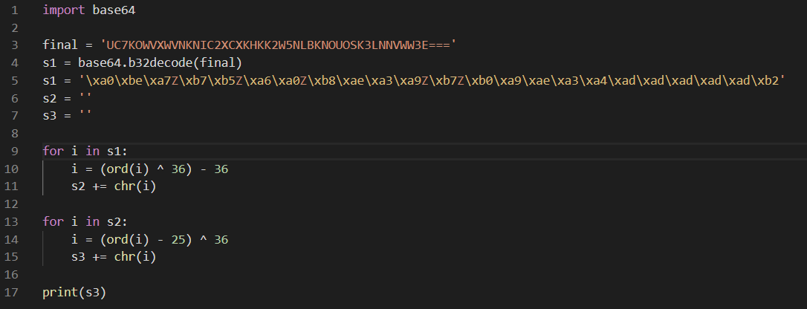

#### 010 转轮机加密
一开始看到二战还有转轮机，以为是恩尼格码类型，后面又看到了托马斯·杰斐逊，然后到网上看了一下，发现转轮机和恩尼格码机还是不太一样的。转轮机有若干个转盘（本题13个），边缘上乱序排布这26个字母，根据密钥先把转盘按顺序排布一下，然后根据密码，转动每个转盘，使得密文都排布在同一列（这里我设在了第一列），然后一次读取其他列，最终找到能看懂的一串作为flag，比较坑的是不用加cyberpeace{}或者flag{}，我在这里一直过不去。

#### 011 Normal_RSA
这个是我遇到的rsa类型第二种，题目给了一个由公钥加密的密文文件，另外还给了一个公钥文件，首先将公钥pem文件解析一下，有在线解析工具，也可以用openssl进行解析，得到rsa算法当中的n, e。

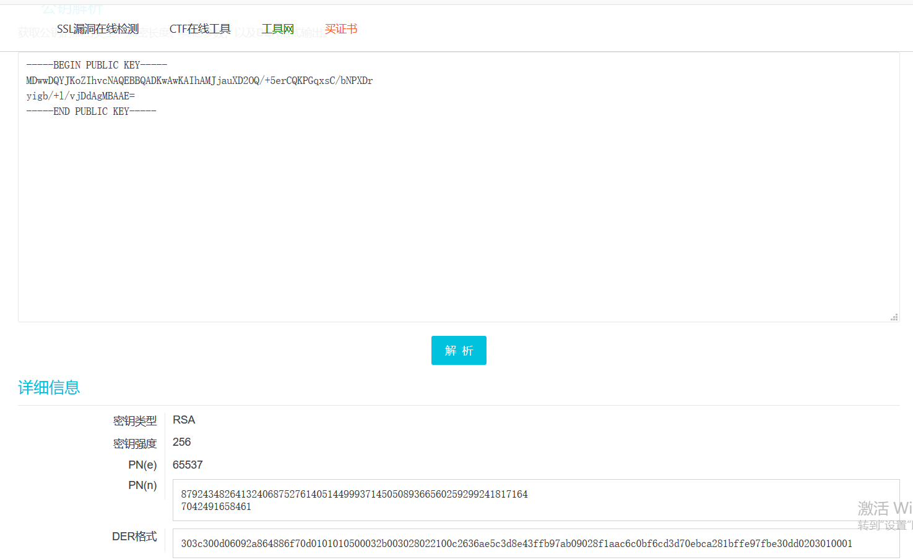

然后需要分解大整数n，这一步也有在线工具，不过有一个工具叫yafu，用来分解也是非常快的

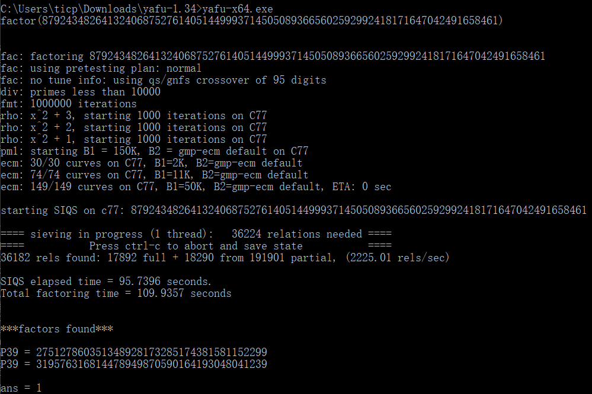

得到rsa算法中的各个参数之后，用python当中的rsa模块生成私钥，并用私钥解密文件，得到flag。

#### 012 easy_ECC
（十分后悔当初没有学好抽象代数）

首先在网上找了一些资料看一下，先复习一下ecc的基本原理，有篇[博客](https://bbs.pediy.com/thread-253672.htm)写的非常详细，感觉很适合入门，看完基本就理解了。

刚开始打算自己用py实现一遍，但是感觉工作量有点大，而且网上有现成的工具了，ecctool非常好用。打开软件记得先选进制为10！然后依次输入椭圆曲线的三个参数p a b，还有私钥k以及基点G，然后开始运行就可以计算出公钥R了。

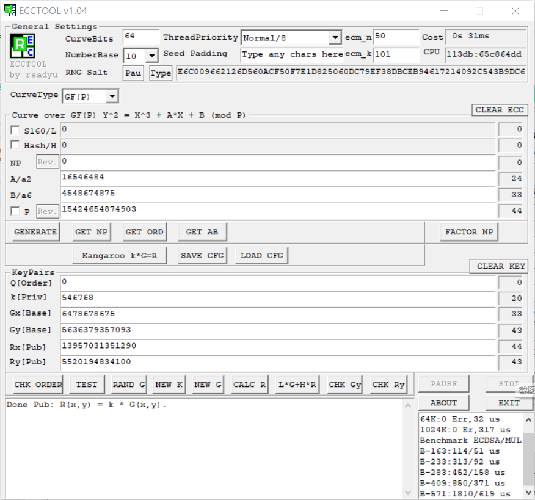

### 高手进阶区

******

## mobile

******
