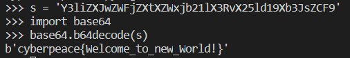

# 记录攻防世界WriteUp

## misc

******

## pwn

******

## web

### 新手练习区

#### 001 view_source
按F12打开查看器即可看到网页源码

#### 002 get_post
url处传get参数

用hackbar传post参数

#### 003 robots
(百度)robots协议也叫robots.txt（统一小写）是一种存放于网站根目录下的ASCII编码的文本文件，它通常告诉网络搜索引擎的漫游器（又称网络蜘蛛），此网站中的哪些内容是不应被搜索引擎的漫游器获取的，哪些是可以被漫游器获取的。因为一些系统中的URL是大小写敏感的，所以robots.txt的文件名应统一为小写。robots.txt应放置于网站的根目录下。

#### 004 backup
php的备份有两种：*.php~和*.php.bak

#### 005 cookie
在控制台查看cookie

用Burp截包查看响应报文

#### 006 disabled_button
把disabled属性删除，按钮就可以按下了

#### 007 weak_auth
根据提示用户名root，弱密码（123456）可以去爆破

#### 008 command_execution
先尝试能否注入命令

发现可以轻松注入后，查找flag文件

查看flag

#### 009 simple_php
分析代码可知要传入两个参数，取a='0'，比较的时候会把a转成数字，如果作逻辑判断则看成非空字符串

b的话传1235a，这样is_numberic会判断不是数字，但是比较的时候会转成1235然后和1234作比较

#### 010 xff_referer
查到http报文头部有两个字段：xff(X-Forwarded-For)是用来识别通过HTTP代理或负载均衡方式连接到Web服务器的客户端最原始的IP地址的HTTP请求头字段，简而言之用来伪造IP，Referer是header的一部分，当浏览器向web服务器发送请求的时候，一般会带上Referer，告诉服务器该网页是从哪个页面链接过来的，服务器因此可以获得一些信息用于处理，简而言之可以伪造域名

#### 011 webshell
用php的system函数来执行命令，先查看目录

然后查看flag

#### 012 simple_js
先在网站尝试了几次密码都不成功，于是就查看网页源代码，发现了一段js代码，拷贝到本地自己分析一下（web_new_012_1.js），代码非常冗余，自己先分析整理一下，除去一些无用变量，到最后发现用户输入的参数其实没有用上，都是被一组常量覆盖掉（web_new_012_2.js）

然后发现除了用户传入的参数，还传了一组参数，所以那个输入参数才应该是正确的密码，开一个终端按照函数的处理方式一下，得到的结果再补上flag的格式Cyberpeace{xxxxxxxxx}即可

### 高手进阶区

******

## reverse

******

## crypto

### 新手练习区

#### 001 base64
使用python中的base64模块来解码即可

#### 002 Caesar
凯撒密码，偏移量为12
推荐一个在线工具非常齐全 [ctf在线工具](http://ctf.ssleye.com/)

### 高手进阶区

******

## mobile

******
