# misc

## 新手练习区

### 001 this_is_flag
题目里面写的就是flag

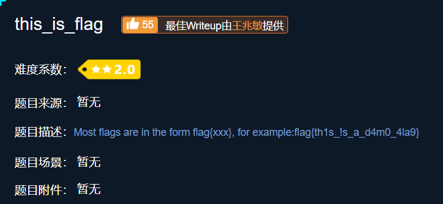

### 002 pdf
将pdf格式的文件转成word就可以看到flag

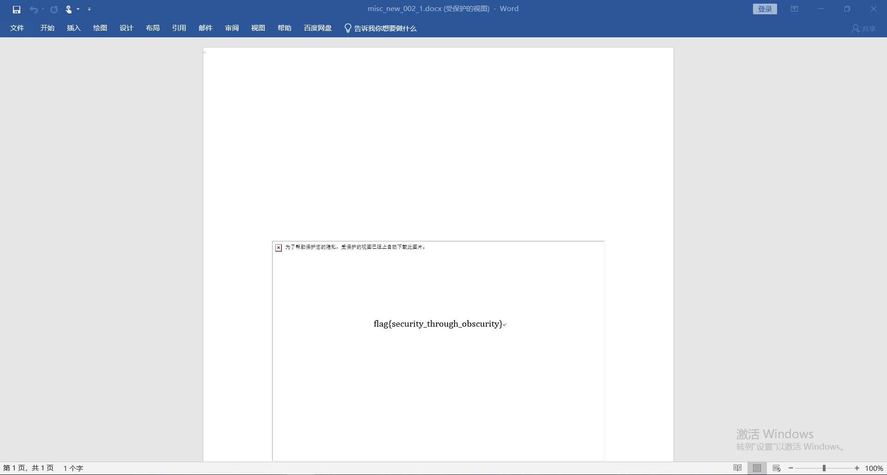

### 003 give_you_flag
给了一个gif，其中有一帧有一个二维码，不会ps，在网上找了别人修好的图，扫码就可以看到flag了。

### 004 gif
给了一系列的黑白图片，猜测黑应该是表示1，白表示0，然后看了一下长度是104，8的倍数，且每八位开头都是0，很有可能是ascii码，用py转化了一下就看到结果了

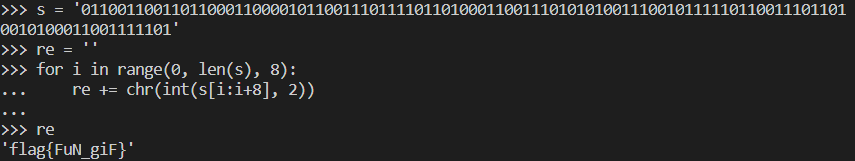

### 005 掀桌子
给了一长串字符，观察一下发下都在f以内，很有可能是十六进制的格式，然后看一下长度也是偶数，有可能两位一组构成一比特，然后每个比特用ascii编码表示，但是都是大于128的数值，所以还要处理一下，减去128，然后再转成ascii编码。

### 006 如来十三掌
先到[与佛论禅](http://www.keyfc.net/bbs/tools/tudoucode.aspx)解密一次

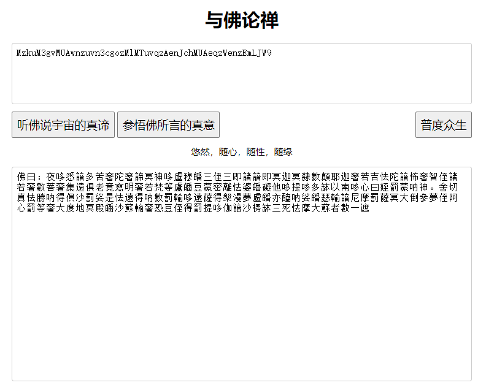

然后根据题目的十三，用rot13解码一次

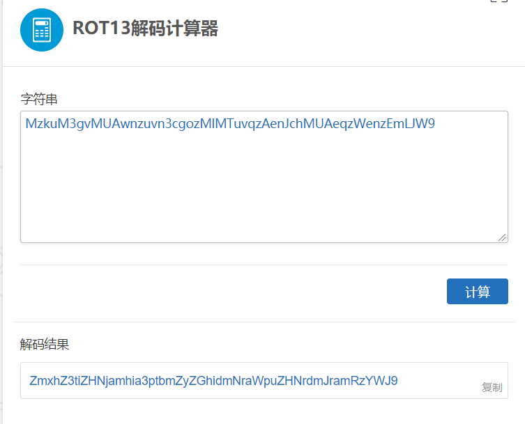

最后用base64解码得到flag

### 007 SimpleRAR
先尝试解压，发现解压失败了，没有头绪去看了别人的writeup，感觉很难想到

首先，用winhex把压缩把的这个7A字段改成74，74在rar里面表示图片

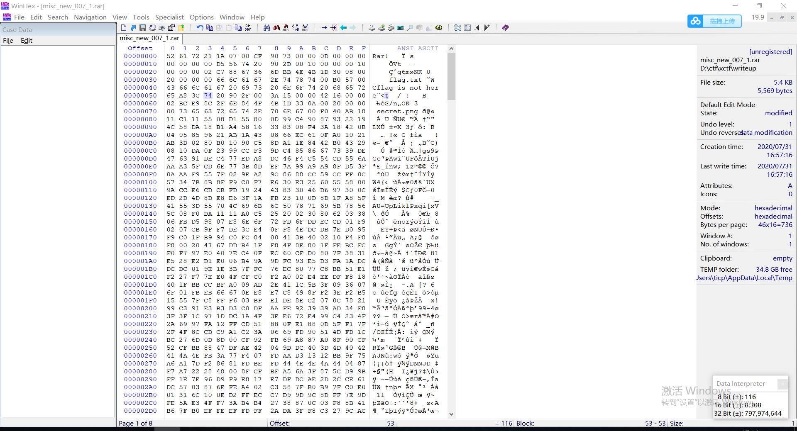

这次解压就能成功解压得到新的图片文件

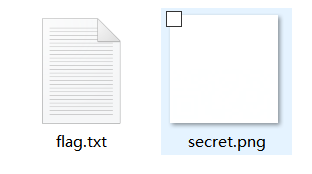

然后继续查看图片的二进制内容，发现开头说明了格式是gif，所以又把图片改成gif后缀。

最后这一步要用ps，把两个图层分开拼成一张二维码，然后还要补上定位点

### 008 坚持60s
刚开始我真的老老实实在玩，一直想坚持60s，但是实在是太难了根本搞不定。后面在网上看到说可以通过反编译，查看一下jar的java源码，用的是jd-GUI 1.6.6，不过好像不兼容高版本的Java，所以要在命令行打开：java -jar jd-gui.exe，然后再用这个工具来反编译

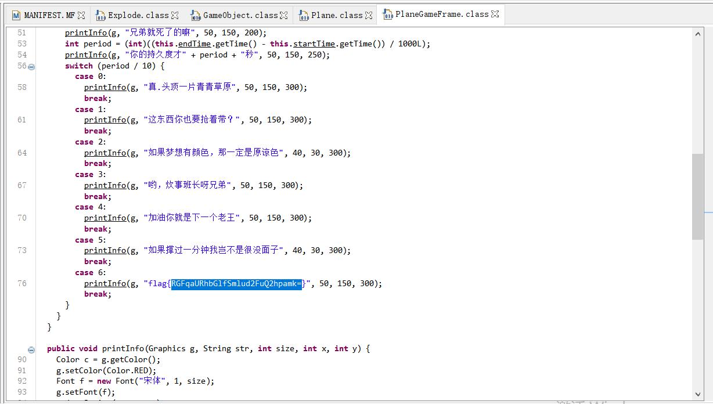

注意这个是base64编码后的，结尾有个=，还要解码一下

### 009 stegano

用chrome打开附件pdf，然后拷贝一下到一个文本文件，就可以看到一串AB字符串，把“A”换成“.”，把“B”换成“-”，可以得到一串摩尔斯电码，然后解密即可得到CONGRATULATIONSFLAG1NV151BL3M3554G3，记得要把字符串转成小写

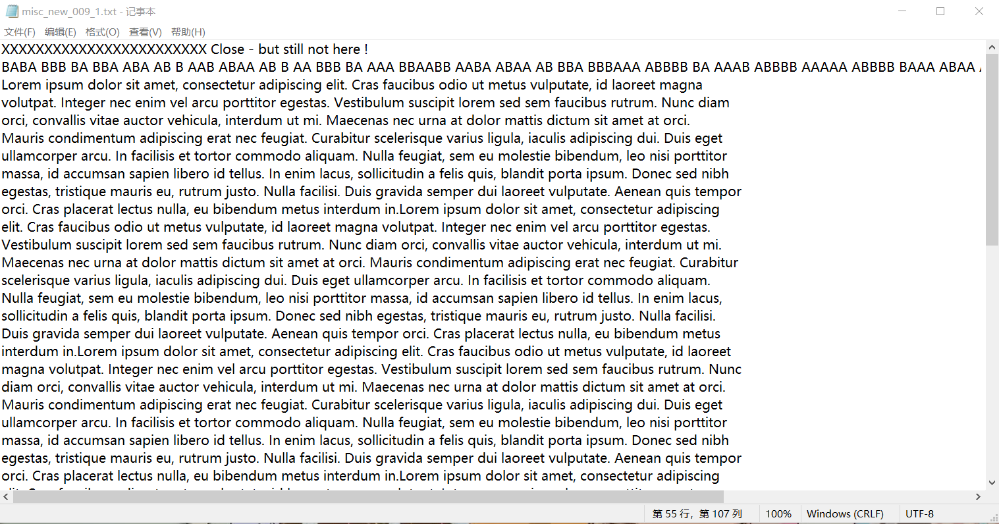

### 010 base64stego

用到了base64编码当中的一个细节，base64把三个字节共24位作为一组，补至32位作为一组进行编码，当不能凑成一组就在后面补0，而实际上补的数据是无关紧要的，可以补1来表示某些信息，所以用base64解码完的数据其实是无关紧要的，而真正的信息却被当成padding而删掉了

在网上找了别人实现的一个py3脚本，运行完就可以得到结果了，flag{Base_sixty_four_point_five}

### 011 ext3

根据题目的提示，是一个Linux系统光盘光盘，所以查看相关的命令，把光盘文件放到Linux后，先挂在到/mnt/目录下面，然后查看一下光盘中的文件系统，查看是否有flag相关的内容

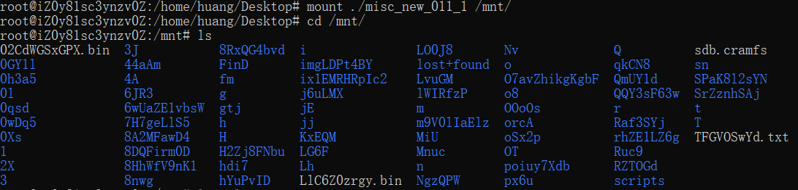

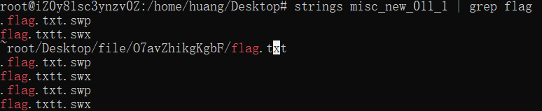

转到/mnt/目录下，去查看flag文件的内容，发现=结尾，应该是base64编码，再用py解码

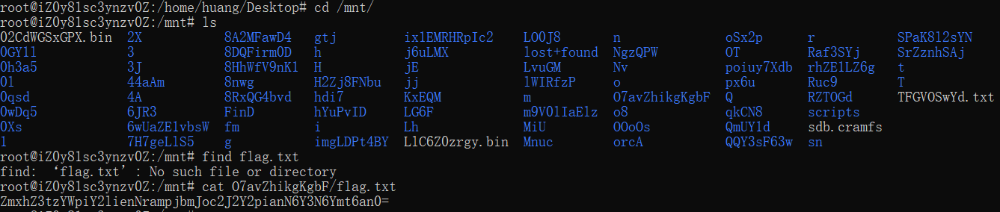

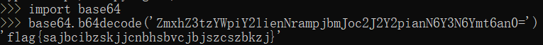

### 012 功夫再高也怕菜刀

[foremost下载安装](https://www.cnblogs.com/cnnnnnn/p/8994362.html)参考了这篇文章，安装了foremost软件，然后用foremost提取文件，发现有一个加密的压缩包里面有flag.txt，但是需要密码才能解压缩

然后对利用wireshark对报文进行分析，找和flag.txt的信息，在wireshark界面选分组字节流进行查询，然后在追踪TCP流，分别对不同报文分析，可以发现相比于其他数据包第7个数据流这里多了一张图片

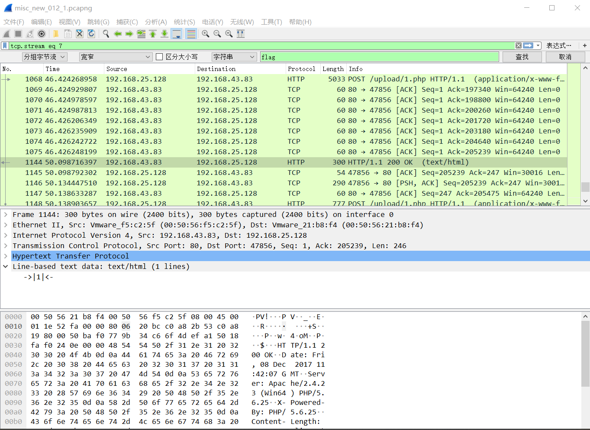

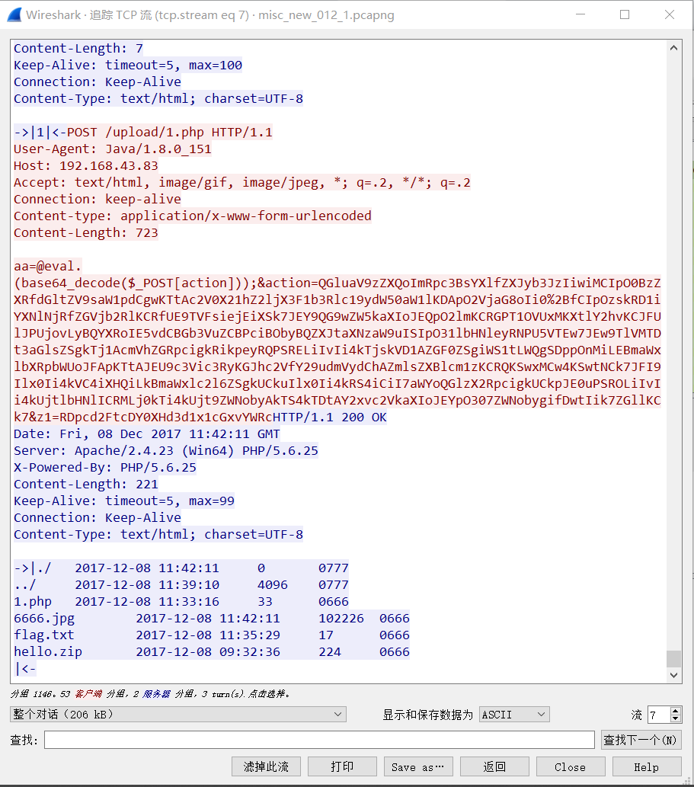

把数据流中的图片信息用winhex保存下来，以FFD8开头以FFD9结尾，然后保存成jpg的格式就可以了，打开图片就可以看到解压的密码

